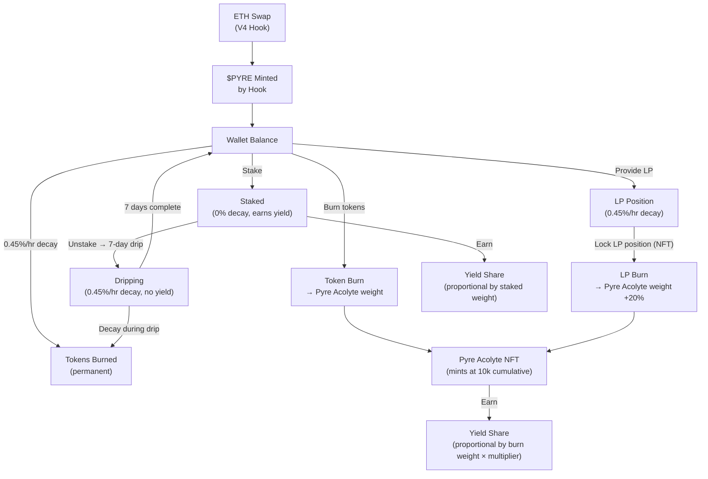
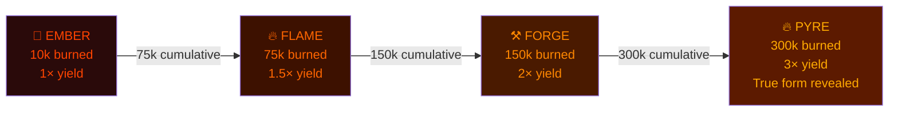
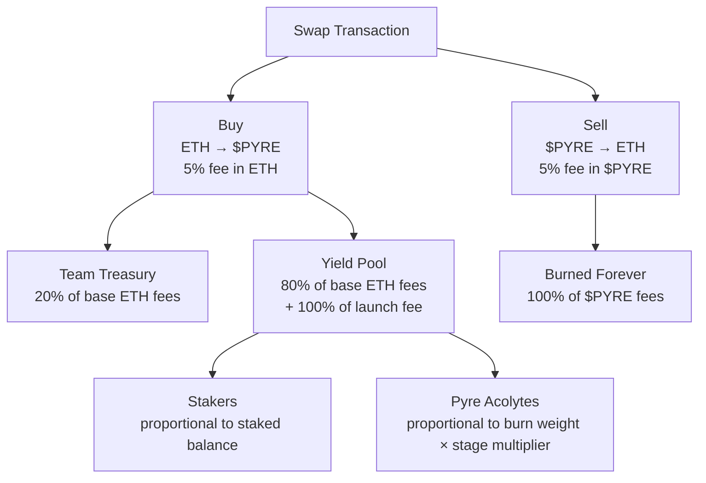
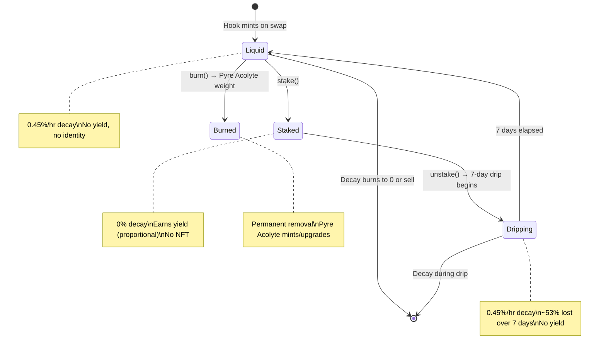
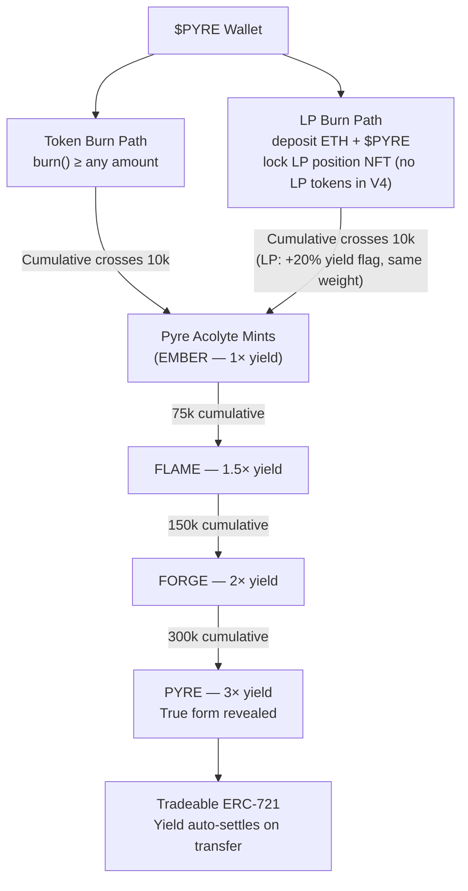

# PYRE — System Map

> Living reference. Update on every design change.

---

## 1. Token Lifecycle

---

## 2. Pyre Acolyte Evolution

Burns accumulate across multiple transactions. No single burn needs to hit the threshold. Art evolves in place — same token ID, changing appearance.

---

## 3. Fee Structure & Yield Distribution

**Fee layers (no UI warnings — hook + pool level only):**
- Hook fee: 4% (both directions)
- Pool fee: 1% (both directions)
- Total: 5% effective each way
- Launch fee: +20% on buys only at hour 0, declining linearly to 0 over 24h (100% to yield pool)

---

## 4. Three Token States

---

## 5. The (3,3) Matrix

| You / Everyone | Stake (+3) | Burn (+3) | Hold liquid (+1) | Sell (−3) |
|---|---|---|---|---|
| **Stake (+3)** | **(3,3) = +6** Best | (3,3) = +6 | (3,1) = +4 | (3,−3) = 0 |
| **Burn (+3)** | (3,3) = +6 | **(3,3) = +6** Best | (3,1) = +4 | (3,−3) = 0 |
| **Hold liquid (+1)** | (1,3) = +4 | (1,3) = +4 | (1,1) = +2 | (1,−3) = −2 |
| **Sell (−3)** | (−3,3) = 0 | (−3,3) = 0 | (−3,1) = −2 | **(−3,−3) = −6** Worst |

Staking and burning are both dominant strategies. Unlike Olympus DAO where (3,3) was social pressure only, PYRE enforces it mechanically — liquid tokens decay at 0.45%/hr regardless of social consensus.

---

## 6. Pyre Acolyte Burn Path

---

## 7. Parameter Reference

### Locked Parameters

| Parameter | Value |
|---|---|
| Token name | Pyre / $PYRE |
| Chain | **OPEN — Ethereum mainnet vs Arbitrum (Robinhood chain)** |
| Supply cap | 1,000,000,000 (1B) |
| Minting | Hook-only, no pre-mine |
| Team allocation | 0% |
| Initial decay rate | **0.45%/hr** |
| Halving interval | **2,000 epochs (~83 days)** |
| Decay floor | **0.01%/hr** |
| Decay rate (LP positions) | Same as liquid |
| Decay rate (staked) | 0% |
| Drip duration | 7 days |
| Drip decay loss (Era 0) | ~53% |
| No yield during drip | Confirmed |
| Pyre Acolyte mint | Burn-to-mint — 10,000 $PYRE cumulative |
| EMBER threshold | 10,000 $PYRE burned |
| FLAME threshold | 75,000 $PYRE burned |
| FORGE threshold | 150,000 $PYRE burned |
| PYRE threshold | 300,000 $PYRE burned |
| Stage multipliers | 1× / 1.5× / 2× / 3× |
| Pyre Acolyte hard cap | None |
| Hook fee | **4% (buy and sell)** |
| Pool swap fee | **1%** |
| Total effective fee | **5% each way** |
| Launch fee (buy only) | **+20% at hour 0 → 0 over 24h, 100% to yield pool** |
| Team cut | **20% of ETH fee revenue** |
| Sell-side fee disposition | **100% burned** |
| Yield distribution | Fully proportional by weight, no fixed split |
| LP burn yield | 2× the normal Acolyte at the same tier, on a separate LP track (v2 target, contract change pending) |
| Staker visual identity | None |
| NFT art rendering | **OPEN — static-per-stage vs on-chain generative SVG not yet decided. Evolves in place by burn weight regardless.** |
| Seed LP | Permanently locked at launch (V4: position NFT locked) |
| Auto-stake on mint | No |

### Open Parameters (Pre-Build)

| Parameter | Status |
|---|---|
| **NFT art rendering approach** | **OPEN — static-per-stage vs on-chain generative SVG. Blocks PyreNFT render layer + final art. Highest priority.** |
| **LP-burn mechanism (V4)** | **DECIDED (2026-06-29): NFT-locker, capture fees → single yield pool. Deployed code still on dead-address (fees stranded) → migrate.** |
| **S(t) rebase × V4 concentrated liquidity** | **OPEN — needs a spike; rebase supply is hostile to V4 ranges and there is no V2 `pair.sync()`.** |
| Art style per stage | TBD (depends on rendering decision above) |
| LP burn / Immolated overlay design | TBD |
| Initial seed LP ETH amount | TBD |
| Chainlink Automation upkeep sizing | TBD |
| BASE_RATE constant (tokens minted per ETH) | TBD |
| Launch date | TBD — date-agnostic, do not hardcode |
| KOL lock period | Deferred — decide before launch |
